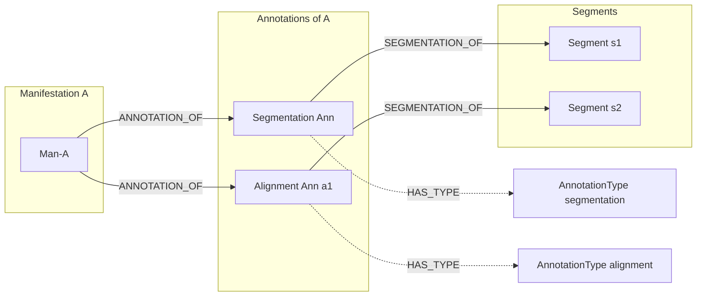
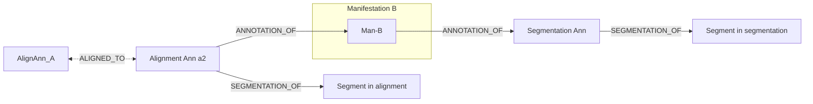
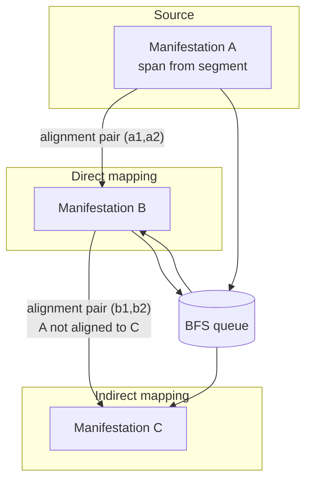
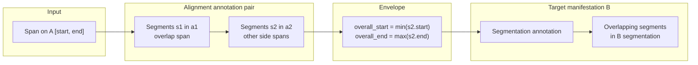

# SQS Segment Mapping Calculator — Documentation

## Introduction

The SQS Segment Mapping Calculator is the core processing service in the pipeline. It consumes messages from the first SQS queue, computes related segment mappings using Neo4j (including graph traversal logic), stores results in PostgreSQL, updates job progress, and publishes completion messages to a second SQS queue.

This service performs the main computation step and supports asynchronous, scalable processing.

---

## 1. Service Overview

**Role in pipeline:** The calculator sits between two SQS queues. It reads batch messages from the first (input) queue, runs the segment-mapping computation, persists results and job state in PostgreSQL, then notifies the next stage by sending to the second (completed) queue.

**End-to-end responsibility:**

1. Parse the incoming SQS message (batch of segments for one job).
2. For each segment in the batch: run Neo4j BFS to compute related segments across manifestations.
3. Upsert each segment’s mapping into the `segment_mapping` table.
4. Update the root job’s `completed_segments` and set status to `IN_PROGRESS` or `COMPLETED` as appropriate.
5. Send one completion message to Queue #2 for the batch.

**Pipeline position:** First queue (input) → this service (compute) → second queue (completion).

---

## 2. SQS Consumption Flow

### Consumer setup

- **Implementation:** `SimpleConsumer` in `app/main.py`, extending `aws_sqs_consumer.Consumer`.
- **Configuration:** `queue_url` from `SQS_QUEUE_URL`, `region` from `AWS_REGION`, `polling_wait_time_ms=50`.
- **Entry point:** Run with `python -m app.main`; the process calls `consumer.start()` and polls the queue.

### Message parsing

- The handler parses the body as JSON: `json.loads(message.Body)`.
- **Required fields:**
  - `root_job_id` — UUID of the root job.
  - `text_id` — Manifestation/text identifier (used as Neo4j manifestation id).
  - `batch_number` — Batch index (passed through; used for context).
  - `total_segments` — Total number of segments for the job.
  - `segments` — List of segment objects, each with `segment_id` and `span`: `{ "start", "end" }`.
  - `source_environment` — Environment label for Neo4j/config (e.g. `DEVELOPMENT`, `PRODUCTION`).
  - `destination_environment` — Target environment label.

### Incoming message schema (Queue #1)

| Field | Type | Description |
|-------|------|-------------|
| `root_job_id` | string (UUID) | Root job identifier. |
| `text_id` | string | Manifestation ID for Neo4j and storage. |
| `batch_number` | number | Batch index. |
| `total_segments` | number | Total segments in the job. |
| `segments` | array | List of `{ "segment_id": string, "span": { "start": number, "end": number } }`. |
| `source_environment` | string | Source environment (e.g. DEVELOPMENT, PRODUCTION). |
| `destination_environment` | string | Destination environment. |

**Sample (Queue #1):**

```json
{
  "root_job_id": "550e8400-e29b-41d4-a716-446655440000",
  "text_id": "manifestation-uuid-123",
  "batch_number": 1,
  "total_segments": 10,
  "segments": [
    { "segment_id": "seg-1", "span": { "start": 0, "end": 100 } },
    { "segment_id": "seg-2", "span": { "start": 100, "end": 200 } }
  ],
  "source_environment": "DEVELOPMENT",
  "destination_environment": "PRODUCTION"
}
```

### Task execution flow

1. The consumer’s `handle_message` extracts the fields above and calls `process_segment_task(...)` in `app/tasks.py`.
2. There is no per-segment “claim” step in code; each SQS message represents a batch. The handler processes every segment in the batch, then performs one job progress update and sends one completion message to Queue #2.
3. For each segment: Neo4j `_get_related_segments(text_id, span_start, span_end, transform=True)` is called, then `_store_related_segments_in_db` upserts the result. After all segments, `_update_root_job_status` is called with the batch size, then `send_completed_mapping_text_to_sqs_service` is invoked once.

---

## 3. Relation Calculation Logic

### Neo4j traversal (BFS)

- **Location:** `_get_related_segments` in `app/neo4j_database.py`.
- **Input:** One `manifestation_id` (the `text_id`) and a span `(start, end)`.
- **Algorithm:** Breadth-first search over the graph of manifestations connected by alignment annotations:
  - A queue is used; the initial item is `{ manifestation_id, span_start, span_end }`.
  - For each dequeued item: get alignment pairs for that manifestation (Cypher in `app/neo4j_quries.py`: Manifestation → ANNOTATION_OF → Annotation with type `alignment` → ALIGNED_TO to another annotation).
  - For each alignment pair not yet traversed: get aligned segments for that alignment and span (`get_aligned_segments`), compute the overall span of those segments, and resolve the other manifestation via `get_manifestation_id_by_annotation_id`.
  - `visited_manifestations` and `traversed_alignment_pairs` are kept to avoid cycles and duplicate edges.
  - The other manifestation is enqueued with the computed span for the next level of BFS.

### Transform option

- When `transform=True` (as used by `app/tasks.py`), for each reached manifestation the service fetches **overlapping segments** on that manifestation (Cypher `get_overlapping_segments`) and returns those as the mapping for that manifestation.
- When `transform=False`, the aligned segments from the alignment query are returned as-is.

### Segment mapping output

- The result is a list of objects: `{ "manifestation_id": str, "segments": [ { "segment_id", "span": { "start", "end" } } ] }`.
- This list is the “segment mapping” for one source segment and is stored in PostgreSQL in `SegmentMapping.result_json`.

---

## 3.1 Segment Mapping Algorithm — Deep Dive

This section explains in detail how the service finds segment mappings: from a manifestation and segment span, through alignment annotations, to related segments on other manifestations (including indirectly connected ones). **Illustrations:** The Mermaid blocks below render as diagrams in GitHub, GitLab, VS Code/Cursor, and most Markdown viewers. A text flow diagram is also included so the flow is visible in plain text. For a visual example and test cases based on the same relations, see [Further reading for better understanding](#further-reading-for-better-understanding) at the end of this section (Excalidraw diagram and OpenPecha `test_relations.py`).

### High-level flow (text diagram)

```
  INPUT: manifestation_id + segment span [start, end]
       |
       v
  +------------------+
  | Current          |
  | Manifestation M  |
  +--------+---------+
       |
       |  For each ALIGNMENT annotation of M
       v
  +------------------+     overlap?      +------------------+
  | Segments in      | -----------------> | Our alignment     |
  | M's segmentation |   (span [s,e])     | segments (a1)     |
  | (span from input)|                    +--------+---------+
  +------------------+                             |
                                                   | ALIGNED_TO
                                                   v
  +------------------+                    +------------------+
  | Result: mapping   | <----------------- | Other side        |
  | for M             |  overlapping      | segments (a2)     |
  | segments          |  segments in      | overall span      |
  +------------------+  M's segmentation  +--------+---------+
       ^                                            |
       |                                            v
       |                                    +------------------+
       |                                    | Target           |
       +------------------------------------| Manifestation M' |
                (repeat via BFS:            | segmentation     |
                 M' becomes M next)         +------------------+
```

### Neo4j graph model

The algorithm operates on a graph where manifestations are linked by annotations. Two annotation types matter:

- **Segmentation:** One per manifestation; holds the canonical segments (with `span_start`, `span_end`) that we return as mapping results.
- **Alignment:** Pairs of annotations (one per manifestation) that are linked by `ALIGNED_TO`; each alignment annotation has segments linked by `ALIGNED_TO` to segments in the other annotation.





- **Manifestation** — `(m:Manifestation)`; one node per text manifestation.
- **Annotation** — `(a:Annotation)`; has `ANNOTATION_OF` to exactly one Manifestation and `HAS_TYPE` to an AnnotationType (`alignment` or `segmentation`).
- **Segment** — `(s:Segment)`; has `SEGMENTATION_OF` to an Annotation; has `span_start`, `span_end`.
- **Alignment link** — Two alignment annotations are related by `(a1)-[:ALIGNED_TO]-(a2)`. Segments inside a1 and a2 are linked by `(s1)-[:ALIGNED_TO]-(s2)`.

The **span** we use for the source segment comes from the incoming message (`segment.span.start`, `segment.span.end`); it corresponds to that segment's position in the source manifestation's segmentation.

### Step-by-step algorithm

| Step | Action | Purpose |
|------|--------|---------|
| 1 | Receive `manifestation_id` and span `(start, end)` | Input from one segment in the batch (span from message). |
| 2 | Initialize BFS queue with `{ manifestation_id, span_start, span_end }`; mark manifestation visited | Start traversal from source. |
| 3 | Dequeue item; get all alignment pairs for that manifestation | Pairs `(a1, a2)` where a1 is this manifestation's alignment annotation, a2 is the other (Cypher: Manifestation → ANNOTATION_OF → alignment Annotation → ALIGNED_TO → a2). |
| 4 | For each pair not yet traversed: `get_aligned_segments(a1, span)` | Find segments in **our** alignment (a1) that overlap the span; return the **other** side's segments (s2 in a2) with their spans. |
| 5 | Compute overall span from returned segments | `overall_start = min(span_start)`, `overall_end = max(span_end)` over the s2 segments. |
| 6 | Resolve target manifestation | `get_manifestation_id_by_annotation_id(a2_id)` → manifestation_2. |
| 7 | If already visited: skip | Prevents cycles and re-processing. |
| 8 | If `transform=True`: `get_overlapping_segments(manifestation_2, overall_start, overall_end)` | On the **target** manifestation, get segments from its **segmentation** annotation that overlap the overall span; this is the mapping for that manifestation. |
| 9 | Append to result; mark manifestation_2 visited; record traversed pair; enqueue `{ manifestation_2, overall_start, overall_end }` | Produces direct mappings and feeds BFS for indirect mappings (e.g. A → B → C). |

Implementation: `_get_related_segments` in [app/neo4j_database.py](app/neo4j_database.py); Cypher in [app/neo4j_quries.py](app/neo4j_quries.py) (`get_alignment_pairs_by_manifestation`, `get_aligned_segments`, `get_overlapping_segments`).

### Direct vs indirect mapping (BFS)

We discover **direct** mappings (same manifestation as the alignment partner) and **indirect** mappings (reachable only via another manifestation).

**Illustration (traversal):**

```
    [Manifestation A]  ----alignment---->  [Manifestation B]  ----alignment---->  [Manifestation C]
    (source, span)           (direct)            (span from A)        (indirect; A not aligned to C)
         |                        |                       |                              |
         |                        v                       v                              v
         |                  mapping for B           BFS queue                    mapping for C
         |                  (seg-B1, seg-B2)        (B, span)                     (seg-C1, seg-C2)
         v
    BFS queue: (A, span) -> dequeue A -> enqueue (B, span) -> dequeue B -> enqueue (C, span) -> ...
```



- **Direct:** From A we get alignment pairs; one pair leads to B. We compute the span on B's side, then (with transform) overlapping segments in B's **segmentation** → mapping for B.
- **Indirect:** We enqueue B with the computed span. When we dequeue B, we get B's alignment pairs. One pair may lead to C (C is not directly aligned with A). We compute span on C's side and (with transform) overlapping segments in C's segmentation → mapping for C.
- **Visited set:** Once a manifestation is processed (or skipped as already visited), we do not process it again, so we avoid cycles and duplicate work.

### Alignment to segmentation (transform)

Alignment annotations carry segment-to-segment links; the stored mapping is by **segmentation** segments. The transform step converts the "other alignment span" into segmentation segments on the target manifestation.



1. **Input:** Span `[start, end]` on source manifestation A (from the segment in the message).
2. **Alignment:** For one alignment pair `(a1, a2)`, find segments s1 in a1 that overlap the span; get linked segments s2 in a2 (and their spans).
3. **Envelope:** `overall_start` = min of s2 starts, `overall_end` = max of s2 ends.
4. **Transform:** On manifestation B (owner of a2), run `get_overlapping_segments(B, overall_start, overall_end)` against B's **segmentation** annotation; the returned segments are the mapping for B for this alignment.

So the "first answer" for the initial segment on another manifestation is: the set of segmentation segments on that manifestation that overlap the envelope of the aligned segments (from the alignment annotation) on that manifestation's side.

### Example walkthrough

**Setup:**

- **Manifestation A (Man-A):** Source; we have segment seg-A1 with span `[50, 150]`.
- **Man-A ↔ Man-B alignment:** A-side segments overlapping [50,150]: [50,100] and [100,150]. They align to B-side segments with spans [200,250] and [250,300].
- **Man-B segmentation:** seg-B1 `[200, 275]`, seg-B2 `[275, 320]`.
- **Man-B ↔ Man-C alignment:** B and C are aligned; A and C are not.

**Run (transform=True):**

1. **Input:** Man-A, span `[50, 150]`. Queue: `[(Man-A, 50, 150)]`.
2. **Dequeue (Man-A, 50, 150).** Alignment pair (Man-A, Man-B):
   - `get_aligned_segments(a1, 50, 150)` → B-side segments with spans [200,250], [250,300].
   - Overall span on B: `[200, 300]`.
   - Manifestation_2 = Man-B; not yet visited.
   - `get_overlapping_segments(Man-B, 200, 300)` → segments in Man-B's segmentation overlapping [200,300] → **seg-B1, seg-B2**.
   - **Result for Man-B:** `{ "manifestation_id": "Man-B", "segments": [ { "segment_id": "seg-B1", "span": { "start": 200, "end": 275 } }, { "segment_id": "seg-B2", "span": { "start": 275, "end": 320 } } ] }`.
   - Mark Man-B visited; enqueue `(Man-B, 200, 300)`.
3. **Dequeue (Man-B, 200, 300).** Alignment pairs for Man-B: one to Man-A (skip: already visited), one to Man-C:
   - Aligned segments on C's side yield an overall span on C (e.g. [0, 150]).
   - `get_overlapping_segments(Man-C, overall_start, overall_end)` → e.g. seg-C1, seg-C2.
   - **Result for Man-C:** `{ "manifestation_id": "Man-C", "segments": [ ... ] }` (indirect mapping).
   - Enqueue Man-C with that span; Man-C is marked visited.
4. When the queue is empty, the algorithm returns the list of `{ manifestation_id, segments }` entries (Man-B and Man-C in this example).

So we get one mapping per reached manifestation; each mapping is expressed in that manifestation's **segmentation** segments.

### Incoming vs outgoing alignment

The Cypher for alignment pairs is:

`(m:Manifestation)<-[:ANNOTATION_OF]-(a1:Annotation)-[:ALIGNED_TO]-(a2:Annotation)`.

So **a1** is always the current manifestation's alignment annotation ("our" side), and **a2** is the other. We only follow **outgoing** alignment: from our annotation to the other. We do not need a separate "incoming" case, because every alignment is represented as a pair and we consider both directions by recording `(a1,a2)` and `(a2,a1)` in `traversed_alignment_pairs`, and we traverse from each manifestation to its neighbors. The "other alignment span" we use is the span of segments in **a2** (their side); we then query the **segmentation** of the manifestation that owns a2 to get the final mapping segments.

### Further reading for better understanding

You can refer to these external resources for a visual example and executable test cases based on the same relations:

| Resource | Description |
|----------|-------------|
| [Excalidraw: segment mapping relations](https://excalidraw.com/#json=1Vliyd8lBGDc3nDKT8Pbo,5WVEtvfZnQmaHgfP2ulaQA) | Visual example of how manifestations, alignments, and segments relate (drawn in Excalidraw). |
| [OpenPecha backend: test_relations.py](https://github.com/OpenPecha/openpecha-backend/blob/main/functions/tests/test_relations.py) | Test cases written from the same Excalidraw scenario; useful to see expected inputs and outputs. |

---

## 4. Database Operations

### Storing segment_mapping

- **Function:** `_store_related_segments_in_db` in `app/tasks.py`.
- **Mechanism:** SQLAlchemy `insert(SegmentMapping).values(...).on_conflict_do_update(index_elements=[SegmentMapping.root_job_id, SegmentMapping.segment_id], set_={ result_json, status, updated_at })`.
- This uses PostgreSQL `INSERT ... ON CONFLICT` on the unique constraint `uq_segment_mapping_root_job_segment` on `(root_job_id, segment_id)` (see `app/db/models.py`).
- One row per segment; the mapping list is stored in `result_json`; `status` is set to `COMPLETED`.

### Upsert / idempotency strategy

- Re-processing the same batch or segment overwrites `result_json` and `status` for that `(root_job_id, segment_id)`. Duplicate messages or retries do not create duplicate rows and produce consistent results.

### Job status and progress updates

- **Function:** `_update_root_job_status(job_id, inc=total_segments)` in `app/tasks.py`.
- **Behavior:** Updates `RootJob`: adds `inc` to `completed_segments`, sets `status` to `COMPLETED` when `completed_segments >= total_segments`, or to `IN_PROGRESS` when the job was `QUEUED` and now has progress. The update is conditional: `WHERE status != 'COMPLETED'`, so completed jobs are not overwritten.

---

## 5. Queue #2 Publishing

- **When:** After all segments in the batch are processed and the root job’s `completed_segments` (and status) have been updated, `app/tasks.py` calls `send_completed_mapping_text_to_sqs_service(...)` once per batch.
- **Purpose:** Notify downstream that mapping for the given text and the listed segment IDs has been completed for this batch, so the next stage (e.g. aggregation, export, or another service) can proceed.

---

## 6. Queue #2 Payload

### Message schema

The body is a single JSON object with:

| Field | Type | Description |
|-------|------|-------------|
| `text_id` | string | Manifestation/text identifier. |
| `segment_ids` | array of string | Segment IDs processed in this batch. |
| `total_segments` | number | Total segments for the job. |
| `source_environment` | string | Source environment (e.g. DEVELOPMENT, PRODUCTION). |
| `destination_environment` | string | Destination environment. |

### Sample JSON (Queue #2)

```json
{
  "text_id": "manifestation-uuid-123",
  "segment_ids": ["seg-1", "seg-2"],
  "total_segments": 10,
  "source_environment": "DEVELOPMENT",
  "destination_environment": "PRODUCTION"
}
```

---

## 7. Reliability Concerns

### Retries

- Retry behavior is not configured in this repo; it comes from the `aws-sqs-consumer` library and/or AWS SQS (e.g. visibility timeout, redrive, dead-letter queue). The application does not implement its own retry loop for task processing.

### Visibility timeout

- Not set in application code. Configure the SQS input queue in AWS with an appropriate visibility timeout (e.g. 60+ seconds as recommended in the README) so that if a worker fails mid-processing, the message becomes visible again for another worker.

### Multi-worker and concurrency

- One consumer process per process; scaling is by running multiple processes (e.g. multiple instances on Render or multiple `python -m app.main`). There is no in-repo concurrency limit.
- **Idempotency:** The segment_mapping upsert on `(root_job_id, segment_id)` and the job update restricted to `status != 'COMPLETED'` avoid corrupting results when the same batch is processed more than once. Duplicate completion messages to Queue #2 can still occur if a batch is processed twice; downstream consumers should be idempotent if required.

---

## 8. Error Handling, Logging, Config & Libraries

### Error handling

- Exceptions in `process_segment_task` are re-raised; there is no in-task retry. The SQS send in `app/sqs_service.py` catches exceptions, logs with `logger.error`, and re-raises. Failed processing typically results in the message returning to the queue (or moving to a DLQ) according to SQS and consumer behavior.
- The `SegmentMapping` model has `status` (including `RETRYING`, `FAILED`) and `error_message`; the current success path only sets `COMPLETED` and does not populate failure status in this code path.

### Logging

- Standard library `logging` is used. `logging.basicConfig` is set in `app/main.py` (level INFO, format with timestamp, name, level, message). Module-level loggers are used in `main`, `tasks`, `neo4j_database`, and `sqs_service` for INFO (flow) and ERROR (e.g. send failure).

### Config

- **File:** `app/config.py`; `load_dotenv()` loads `.env`. A `Config` dict is populated from the environment; `get(key)` returns values.
- **Variables:** Neo4j (`NEO4J_USER`, `DEVELOPMENT_NEO4J_URI`, `DEVELOPMENT_NEO4J_PASSWORD`, `PRODUCTION_NEO4J_URI`, `PRODUCTION_NEO4J_PASSWORD`), `POSTGRES_URL`, AWS (`AWS_REGION`, `AWS_ACCESS_KEY_ID`, `AWS_SECRET_ACCESS_KEY`), `SQS_QUEUE_URL`, `SQS_COMPLETED_QUEUE_URL`. The Neo4j driver also resolves `{source.upper()}_NEO4J_URI` and `{source.upper()}_NEO4J_PASSWORD` (e.g. from `env.example`).

### Libraries

- From `requirements.txt`: `pydantic`, `sqlalchemy`, `alembic`, `psycopg2-binary`, `neo4j`, `python-dotenv`, `boto3`, `aws-sqs-consumer==0.0.15`. No separate logging framework.

---